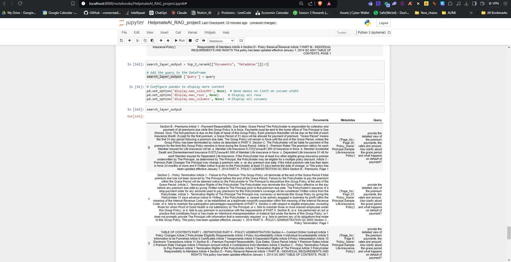
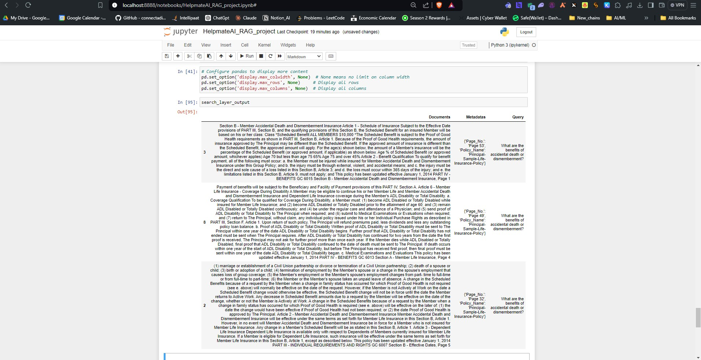
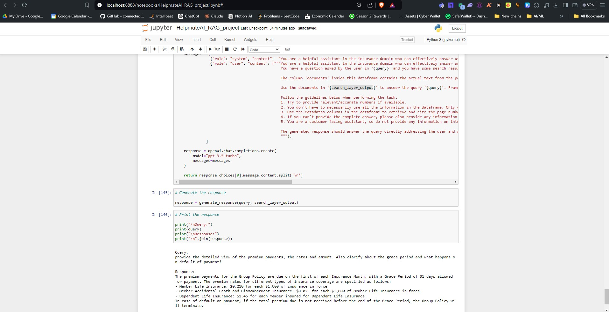
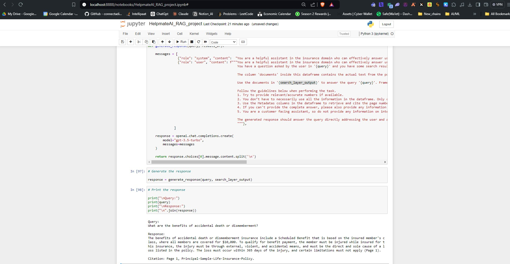

# HelpmateAI: RAG-based QA System for Research Papers

HelpmateAI is a Retrieval-Augmented Generation (RAG) system designed to answer complex questions from long research documents using OpenAI LLMs.

## 🧠 Problem Statement
Can we build a smart QA assistant that reads and understands research papers/ policy documents to return precise, context-rich answers to domain-specific queries?

## 📄 Data
- This system was tested on a real-world **life insurance policy document**, available here:  
📘 [Principal-Sample-Life-Insurance-Policy.pdf](Principal-Sample-Life-Insurance-Policy.pdf)
- Chunked and embedded using sentence transformers

## ⚙️ Approach
- Embedding Layer: Sentence Transformers + chunking strategy
- Vector DB: ChromaDB
- Search Layer: query embedding + reranking using cross-encoders
- Generation Layer: OpenAI GPT with few-shot prompt templates

## 🧪 Results
- 90%+ retrieval accuracy in top-3 matches (via reranking)
- Meaningful multi-sentence generated answers

## 📷 Sample Outputs

### 🔍 Search Layer

### 💬 Generation Layer

## 📄 Documentation
See the detailed process and challenges in [HelpmateAI_RAG_Project_Documentation.pdf](HelpmateAI_RAG_Project_Documentation.pdf)

## 🧰 Tech Stack
`Python`, `LangChain`, `ChromaDB`, `OpenAI`, `Transformers`, `Scikit-learn`
