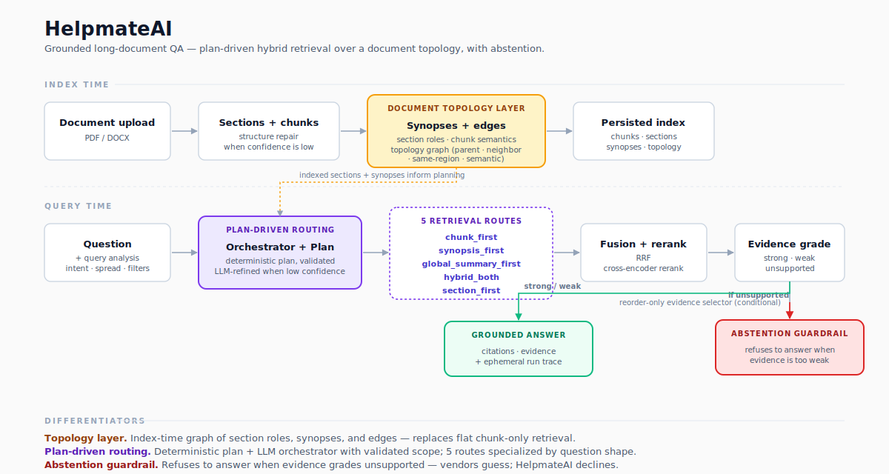

# HelpmateAI

HelpmateAI is a document-aware RAG system for long PDFs and DOCX files. On the current project benchmark, it beats Vectara and OpenAI File Search by planning retrieval over document topology instead of stuffing dense top-k chunks into an answer model.

It is built for the questions where ordinary "chat with PDF" systems break: broad thesis conclusions, research-paper contributions, policy clauses, scattered evidence, weak retrieval, and citation-sensitive answers.

- Live landing page: https://helpmateai.xyz
- Workspace app: https://app.helpmateai.xyz
- Architecture flow: [docs/architecture-flow.md](docs/architecture-flow.md)
- Benchmark summary: [docs/evals/benchmark_summary.md](docs/evals/benchmark_summary.md)
- Architecture decisions: [docs/adr/README.md](docs/adr/README.md)

## Benchmark Headline

**On the stabilized 2026-04-19 four-document benchmark suite, HelpmateAI leads both Vectara and OpenAI File Search across every measured answer-quality metric.**

Average margin across health policy, thesis, `pancreas7`, and `pancreas8`:

| Baseline | Faithfulness | Answer relevancy | Context precision |
| --- | ---: | ---: | ---: |
| Vectara retrieval + shared answer model | `+0.1997` | `+0.1350` | `+0.1523` |
| OpenAI File Search + shared answer model | `+0.4532` | `+0.4021` | `+0.3697` |

Current answer-quality snapshot:

| Document | System | Faithfulness | Answer relevancy | Context precision |
| --- | --- | ---: | ---: | ---: |
| Health policy | HelpmateAI | `0.8846` | `0.6378` | `0.8825` |
| Health policy | Vectara | `0.7692` | `0.4504` | `0.8235` |
| Health policy | OpenAI File Search | `0.6154` | `0.1357` | `0.4970` |
| Thesis | HelpmateAI | `1.0000` | `0.6031` | `0.8588` |
| Thesis | Vectara | `0.8750` | `0.5579` | `0.8035` |
| Thesis | OpenAI File Search | `0.3702` | `0.2944` | `0.6024` |
| `pancreas7` | HelpmateAI | `0.9444` | `0.6499` | `1.0000` |
| `pancreas7` | Vectara | `0.6111` | `0.5009` | `0.7350` |
| `pancreas7` | OpenAI File Search | `0.5556` | `0.2514` | `0.6210` |
| `pancreas8` | HelpmateAI | `0.9250` | `0.5527` | `0.9000` |
| `pancreas8` | Vectara | `0.7000` | `0.3941` | `0.6700` |
| `pancreas8` | OpenAI File Search | `0.4000` | `0.1535` | `0.4422` |

These scores use `ragas` faithfulness, answer relevancy, and no-reference context precision. Vendor rows use the vendor retrieval context with the shared Helpmate answer model so retrieval quality can be compared more directly.

Methodology note: these are project benchmarks, not a universal claim that HelpmateAI is better than every tuned vendor deployment. The four-document suite includes documents and question families used during HelpmateAI development, so local settings are better adapted to this workload than vendor defaults. Vendor answer rows use the same Helpmate answer generator on top of vendor retrieval contexts, with up to five retrieved snippets truncated to 400 characters each. HelpmateAI uses its own final evidence bundle, currently `final_top_k=4`. `ragas` is judged with the configured OpenAI-backed evaluation stack and uses no-reference metrics because the datasets are retrieval-labeled rather than gold-answer datasets.

The strongest defensible reading is: **on this long-document QA workload, HelpmateAI's topology-aware retrieval and abstention pipeline outperforms the tested vendor retrieval configurations.** The next validation target is a blind, never-tuned document set with equalized context budgets, per-intent reporting, attempted-only faithfulness, abstention rates, and a second judge model family.

## What Makes It Different

Most RAG demos retrieve the top chunks and hope the answer model can stitch them together. HelpmateAI treats retrieval as a planned workflow over a structured document map.

| Typical RAG failure | HelpmateAI behavior |
| --- | --- |
| "What are the conclusions?" returns a few random result paragraphs. | A dedicated `global_summary_first` route anchors overview, findings, discussion, and conclusion regions before assembling raw chunk evidence. |
| The model answers even when retrieval is weak. | Evidence is graded as `strong`, `weak`, or `unsupported`; unsupported questions stop before answer generation. |
| Section-scoped questions drift into the wrong chapter or policy region. | A bounded orchestrator can resolve explicit local scope to validated section IDs, with deterministic safety checks. |
| The right chunk appears in top-k but not at rank 1. | A spread-triggered, reorder-only evidence selector can promote stronger evidence without pruning away support. |
| Architecture changes are chosen by intuition. | The repo carries ADRs, ablations, and benchmark reports for retrieval, reranking, planning, abstention, and evidence selection. |

## Architecture

The diagram leads with the index/query split. Color is reserved for the three parts that make HelpmateAI different from off-the-shelf RAG: amber for the document-topology layer, violet for plan-driven routing, and red for the abstention guardrail. The dashed amber handoff from topology to planning is the core design: query-time retrieval is guided by index-time document structure.

Detailed flow: [docs/architecture-flow.md](docs/architecture-flow.md)

## Product Preview

### Landing experience

### Workspace flow

| Workspace | Answer panel |
| --- | --- |
|  |  |

### Evidence visibility

## Receipts

- 13 architecture decision records in [docs/adr/](docs/adr/)
- 100+ saved evaluation reports in [docs/evals/reports/](docs/evals/reports/)
- External baseline comparisons against Vectara and OpenAI File Search
- Internal ablations for reranking, chunking, planning, topology, selector behavior, and support guardrails
- Negative-question evaluation for honest abstention behavior

Recent validation highlights:

- Reranker improved answer-layer supported rate from `0.8026` to `0.8816`.
- Reranker improved citation page-hit rate from `0.6974` to `0.8684`.
- Planner plus reranker lifted evidence-fragment recall to `0.7364`.
- Support guardrail eval produced `1.0000` calibration negative abstention and `0.0000` false support on the latest reported run.
- The smart-indexing/orchestrator upgrade improved targeted answer relevancy by `+0.0966` and context precision by `+0.1000` versus `main` while preserving supported rate.

## How It Is Built

The retrieval core lives in `src/` and stays framework-agnostic. `backend/` exposes it through FastAPI upload, index, status, and ask endpoints. `frontend/` ships the Next.js workspace UI. `deploy/vps/` contains the Docker Compose and Caddy deployment path for the API, while the public app is split between landing, workspace, and backend surfaces.

Built with Next.js, FastAPI, Docling with `pypdf` fallback, ChromaDB, OpenAI, sentence-transformers, scikit-learn, optional Supabase persistence, optional hosted Chroma-compatible storage, Docker, and `uv`.

PDF extraction defaults to `HELPMATE_PDF_EXTRACTOR=auto`, which tries Docling first for layout-aware Markdown and table preservation, then falls back to `pypdf` when a PDF cannot be converted. DOCX extraction defaults to `HELPMATE_DOCX_EXTRACTOR=auto`, which applies the same Docling-first policy with `python-docx` fallback.

## Repository Map

| Path | Purpose |
| --- | --- |
| `frontend/` | Next.js product UI |
| `backend/` | FastAPI boundary over the retrieval core |
| `src/` | Ingestion, chunking, retrieval, generation, cache, evals, and shared services |
| `src/structure/` | Section extraction, repair signals, document profiles |
| `src/query_analysis/` | Query intent and retrieval-plan signals |
| `src/sections/` | Section records, synopses, and topology helpers |
| `tests/` | Focused checks around core behavior |
| `docs/architecture.md` | Detailed system architecture |
| `docs/architecture-flow.md` | End-to-end flow diagram |
| `docs/evals/` | Benchmark datasets, reports, and evaluation policy |
| `docs/adr/` | Architecture decision records |
| `deploy/vps/` | VPS deployment bundle |

## Current Limits

HelpmateAI is strongest on grounded long-document QA, policy questions, thesis/report navigation, and citation-visible answers. The hardest remaining cases are the broadest academic synthesis prompts on noisy journal-style PDFs, plus broader held-out coverage for orchestrated local-scope behavior.

Those limitations are tracked publicly because the project is benchmark-driven: the point is not to claim perfect RAG, but to make retrieval decisions measurable.
