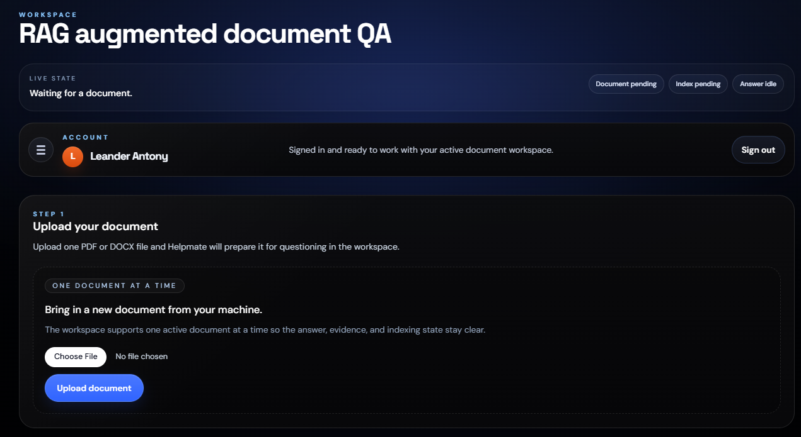
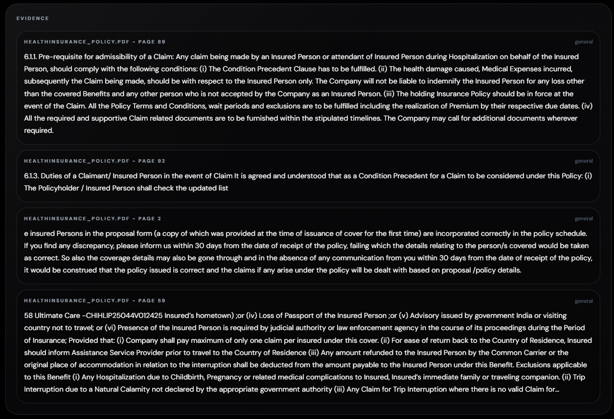

# HelpmateAI

HelpmateAI is a document-aware RAG system for long PDFs and DOCX files. It plans retrieval over document topology instead of treating every question as a flat dense top-k search.

It is built for the questions where ordinary "chat with PDF" systems break: broad thesis conclusions, research-paper contributions, policy clauses, scattered evidence, weak retrieval, and citation-sensitive answers.

The diagram leads with the index/query split. Color is reserved for the three parts that make HelpmateAI different from off-the-shelf RAG: amber for the document-topology layer, violet for plan-driven routing, and red for the abstention guardrail. The dashed amber handoff from topology to planning is the core design: query-time retrieval is guided by index-time document structure.

- Live landing page: https://helpmateai.xyz
- Workspace app: https://app.helpmateai.xyz
- Architecture flow: [docs/architecture-flow.md](docs/architecture-flow.md)
- Evaluation notes: [docs/evals/README.md](docs/evals/README.md)
- Architecture decisions: [docs/adr/README.md](docs/adr/README.md)

## Latest Validation Snapshot

The latest saved held-out product-fit run is [final_eval_suite_20260429_033628.json](docs/evals/reports/final_eval_suite_20260429_033628.json). It used 50 fixed questions across five public documents, judged with RAGAS using Gemini 2.5 Flash plus OpenAI embeddings.

That run showed the current shape of the system clearly:

| Metric | HelpmateAI |
| --- | ---: |
| Questions | `50` |
| Answerable questions | `45` |
| Unsupported questions | `5` |
| Answerable supported rate | `0.9111` |
| Unsupported abstention rate | `1.0000` |
| False support rate | `0.0000` |
| False abstention rate | `0.0889` |

The same run also exposed an evaluation-methodology issue: HelpmateAI had been generated from its full selected evidence, while RAGAS was judging against a clipped context payload. The eval harness now supports native-context and equalized-context modes so future reports can separate product behavior from controlled retrieval comparisons.

## Evaluation Methodology

Evaluation is treated as part of the architecture, not a one-off demo. The current final-eval harness uses fixed public documents, frozen question manifests, answerable and intentionally unsupported questions, per-intent reporting, and saved machine-readable reports under `docs/evals/reports/`.

The latest held-out suite uses:

- public source documents recorded in [final_eval_sources_20260428.md](docs/evals/final_eval_sources_20260428.md)
- frozen draft questions in [final_eval_questions.draft.json](docs/evals/final_eval_questions.draft.json)
- RAGAS scoring with a non-generator judge model where configured
- explicit abstention metrics alongside answer-quality metrics
- separate native-context and equalized-context modes for future product and controlled retrieval comparisons
- documented vendor comparison settings when OpenAI File Search or Vectara baselines are run

Full protocol details live in [final_eval_protocol.md](docs/evals/final_eval_protocol.md), with the broader evaluation plan in [next_steps_and_final_eval_plan.md](docs/internal/next_steps_and_final_eval_plan.md).

## What Makes It Different

Most RAG demos retrieve the top chunks and hope the answer model can stitch them together. HelpmateAI treats retrieval as a planned workflow over a structured document map.

| Typical RAG failure | HelpmateAI behavior |
| --- | --- |
| "What are the conclusions?" returns a few random result paragraphs. | A dedicated `global_summary_first` route anchors overview, findings, discussion, and conclusion regions before assembling raw chunk evidence. |
| The model answers even when retrieval is weak. | Evidence is graded as `strong`, `weak`, or `unsupported`; unsupported questions stop before answer generation. |
| Section-scoped questions drift into the wrong chapter or policy region. | A bounded orchestrator can resolve explicit local scope to validated section IDs, with deterministic safety checks. |
| The right chunk appears in top-k but not at rank 1. | A spread-triggered, reorder-only evidence selector can promote stronger evidence without pruning away support. |
| Architecture changes are chosen by intuition. | The repo carries ADRs, ablations, and benchmark reports for retrieval, reranking, planning, abstention, and evidence selection. |

## Product Preview

### Landing experience

### Workspace flow

| Workspace | Answer panel |
| --- | --- |
|  |  |

### Evidence visibility

## Receipts

- 13 architecture decision records in [docs/adr/](docs/adr/)
- 100+ saved evaluation reports in [docs/evals/reports/](docs/evals/reports/)
- External baseline comparison scaffolding for Vectara and OpenAI File Search
- Internal ablations for reranking, chunking, planning, topology, selector behavior, and support guardrails
- Negative-question evaluation for honest abstention behavior

Recent validation highlights:

- Held-out product-fit run: `45/50` questions answerable, `5/50` intentionally unsupported.
- HelpmateAI supported `91.11%` of answerable questions and abstained on `100%` of unsupported questions.
- The latest final-eval run identified a RAGAS context-budget mismatch, so corrected native/equalized context reporting is now part of the eval harness.
- Typed artifact indexing now keeps tables, footnotes, front matter, and bibliography entries searchable without letting them dominate ordinary prose retrieval.

## How It Is Built

The retrieval core lives in `src/` and stays framework-agnostic. `backend/` exposes it through FastAPI upload, index, status, and ask endpoints. `frontend/` ships the Next.js workspace UI. `deploy/vps/` contains the Docker Compose and Caddy deployment path for the API, while the public app is split between landing, workspace, and backend surfaces.

Built with Next.js, FastAPI, Docling with `pypdf` fallback, ChromaDB, OpenAI, sentence-transformers, scikit-learn, optional Supabase persistence, optional hosted Chroma-compatible storage, Docker, and `uv`.

PDF extraction defaults to `HELPMATE_PDF_EXTRACTOR=auto`, which tries Docling first for layout-aware Markdown and table preservation, then falls back to `pypdf` when a PDF cannot be converted. DOCX extraction defaults to `HELPMATE_DOCX_EXTRACTOR=auto`, which applies the same Docling-first policy with `python-docx` fallback.

## Repository Map

| Path | Purpose |
| --- | --- |
| `frontend/` | Next.js product UI |
| `backend/` | FastAPI boundary over the retrieval core |
| `src/` | Ingestion, chunking, retrieval, generation, cache, evals, and shared services |
| `src/structure/` | Section extraction, repair signals, document profiles |
| `src/query_analysis/` | Query intent and retrieval-plan signals |
| `src/sections/` | Section records, synopses, and topology helpers |
| `tests/` | Focused checks around core behavior |
| `docs/architecture.md` | Detailed system architecture |
| `docs/architecture-flow.md` | End-to-end flow diagram |
| `docs/evals/` | Benchmark datasets, reports, and evaluation policy |
| `docs/adr/` | Architecture decision records |
| `deploy/vps/` | VPS deployment bundle |

## Current Limits

HelpmateAI is strongest on grounded long-document QA, policy questions, thesis/report navigation, and citation-visible answers. The hardest remaining cases are the broadest academic synthesis prompts on noisy journal-style PDFs, plus broader held-out coverage for orchestrated local-scope behavior.

Those limitations are tracked publicly because the project is benchmark-driven: the point is not to claim perfect RAG, but to make retrieval decisions measurable.
