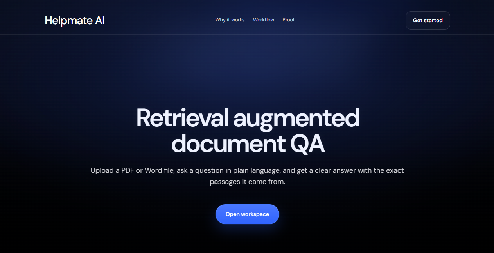
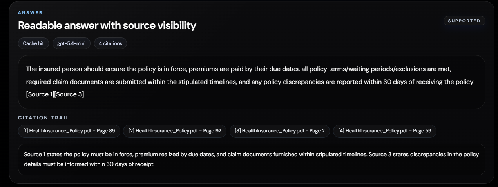

# HelpmateAI

HelpmateAI is a grounded long-document QA system for PDFs and DOCX files. Upload a policy, thesis, or research paper, ask a question in plain language, and get a readable answer with visible citations and raw supporting evidence.

The current product direction is a `Next.js + FastAPI` experience on top of a benchmark-driven Python retrieval core. The system is designed to stay inspectable: retrieval is hybrid, answers are citation-aware, and the supporting passages remain visible instead of being hidden behind a polished summary.

## Why This Project Stands Out

- grounded answers instead of generic document chat
- visible citation trail plus raw evidence panels
- structure-aware retrieval for policies, theses, and research papers
- benchmark-driven architecture decisions instead of intuition-only RAG tuning
- a product-facing `Next.js` shell backed by a modular Python core

## Product Preview

### Landing experience

### Workspace flow

| Workspace | Answer panel |
| --- | --- |
|  |  |

### Evidence visibility

## Core Workflow

1. Upload a PDF or DOCX file.
2. Build or reuse the document index.
3. Ask a natural-language question.
4. Review the answer, citation trail, and raw evidence together.

## Benchmark Highlights

- reranker improved answer-layer supported rate from `0.8026` to `0.8816`
- reranker improved citation page-hit rate from `0.6974` to `0.8684`
- calibrated planner plus reranker slightly improved evidence fragment recall to `0.7364`
- bounded evidence selection remains experimental because it increased cost while reducing faithfulness on the current benchmark suite

## What It Does

- uploads long-form PDF and DOCX documents
- builds or reuses a persisted local Chroma index keyed by document fingerprint
- runs hybrid retrieval with dense search, lexical search, fusion, and optional reranking
- infers document structure, section kinds, clause metadata, and content-type hints
- uses `chunk_first` for exact factual and clause-style questions
- uses `synopsis_first` for broader narrative or synthesis questions
- uses `hybrid_both` for mixed or distributed evidence questions
- builds section synopses and lightweight topology edges for document-aware retrieval control
- repairs low-confidence journal-style section maps at indexing time with a small bounded model pass
- uses a lightweight LLM-assisted route refinement only when deterministic planning is low-confidence
- uses deterministic structural fallback for weak-evidence cases instead of LLM query rewriting
- uses a dedicated `global_summary_first` route for broad paper-summary questions
- short-circuits obviously irrelevant questions with retrieval guardrails before generation
- runs a bounded post-rerank evidence selector that can promote a lower-ranked chunk when it is more direct than rank 1
- generates grounded answers with citations, evidence panels, and explicit supported/unsupported status
- can now switch from local persistence to a hosted `Supabase + Chroma HTTP` deployment path without changing the retrieval core
- evaluates retrieval quality with a layered benchmark stack:
  - custom retrieval hit-rate and MRR
  - structure-aware retrieval metrics
  - abstention checks
  - Vectara as the primary external retrieval baseline
  - OpenAI File Search as a historical/reference retrieval baseline
  - `ragas` as the main answer-quality metric

## Project Shape

The repo is no longer a notebook demo. It is a real app-shaped project with:

- `frontend/` as the evolving `Next.js` product UI
- `backend/` as the FastAPI boundary over the Python core
- `app.py` as the retained Streamlit research and benchmark shell
- `Dockerfile` as the backend deployment image
- `deploy/vps/` as the simple Docker Compose plus Caddy VPS deployment bundle
- `src/` for reusable ingestion, retrieval, generation, cache, and UI logic
- `src/structure/`, `src/query_analysis/`, `src/sections/`, and `src/query_router.py` for the document-intelligence and routing layers
- `tests/` for focused fast checks around the core logic
- `docs/` for architecture, evaluation policy, roadmap, and history

The original notebook remains only as a historical reference.

## Architecture Snapshot

The current retrieval core is in a strong position:

- it generalizes across policy documents, theses, and research papers
- it competes well against external retrieval baselines
- it now uses document-topology guidance without sacrificing chunk-grounded answers
- it uses indexing-time structure repair only for suspicious low-confidence PDFs instead of pushing more model work into the live query path
- it now has a cleaner global-summary route for broad paper and thesis questions while keeping the factual path stable
- it uses Vectara for external retrieval comparison
- it uses `ragas` for answer-quality comparison
- benchmark-driven ablations now justify keeping reranker
- benchmark-driven ablations now justify keeping calibrated planner/router fallback
- bounded evidence selection remains in the codebase as an experimental layer rather than the default path

## Current Product Direction

HelpmateAI is at the start of a new phase:

- the backend retrieval system is stable enough to keep
- the product shell is shifting to `Next.js + FastAPI`
- Streamlit remains useful for fast iteration, demos, and benchmark visibility, but it is now a secondary shell rather than the main product direction

## Stack

- Next.js
- FastAPI
- Streamlit
- ChromaDB
- optional hosted Chroma-compatible HTTP backend
- optional Supabase-backed state persistence
- OpenAI
- scikit-learn
- sentence-transformers
- `uv` for project and dependency management

## Quickstart

1. Install Python dependencies with `uv` and frontend dependencies with `npm install` in [frontend](frontend).
2. Set `OPENAI_API_KEY` in `.env` if you want live answer generation and evaluation.
3. Run the backend: `uv run uvicorn backend.main:app --reload --port 8001`.
4. Run the frontend: `npm run dev` in [frontend](frontend).
5. Optionally run `streamlit run app.py` for the internal benchmark/debug shell.

`pyproject.toml` and `uv.lock` are the dependency source of truth.

## Deployment Shape

Recommended production split:

- marketing site: Framer on `www`
- product UI: `Next.js` on `app`
- API: `FastAPI` on `api`

Example:

- `www.helpmate.ai` -> Framer
- `app.helpmate.ai` -> Vercel project rooted at [frontend](frontend)
- `api.helpmate.ai` -> FastAPI service using [Dockerfile](Dockerfile)

If Render becomes too expensive for the required memory tier, the backend can also be moved onto a VPS with the included [deploy/vps/docker-compose.yml](deploy/vps/docker-compose.yml) stack while the frontend stays on Vercel.

Important runtime notes:

- the frontend defaults to same-origin `/api`
- production rewrites are controlled by `API_REWRITE_TARGET`
- backend storage paths can be overridden with:
  - `HELPMATE_DATA_DIR`
  - `HELPMATE_UPLOADS_DIR`
  - `HELPMATE_INDEXES_DIR`
  - `HELPMATE_CACHE_DIR`
- backend CORS is controlled by `HELPMATE_CORS_ORIGINS`
- cloud-backed persistence can be enabled with:
  - `HELPMATE_STATE_STORE_BACKEND=supabase`
  - `HELPMATE_VECTOR_STORE_BACKEND=chroma_http`
  - `SUPABASE_URL`
  - `SUPABASE_SERVICE_ROLE_KEY`
  - `HELPMATE_CHROMA_HTTP_*`

See [docs/deployment.md](docs/deployment.md) for the step-by-step deployment plan.

## Important Docs

- [docs/architecture.md](docs/architecture.md)
- [docs/architecture-flow.md](docs/architecture-flow.md)
- [docs/deployment.md](docs/deployment.md)
- [docs/evals/README.md](docs/evals/README.md)
- [docs/evals/benchmark_summary.md](docs/evals/benchmark_summary.md)
- [docs/frontend-reference.md](docs/frontend-reference.md)
- [docs/implementation-history.md](docs/implementation-history.md)
- [docs/adr/README.md](docs/adr/README.md)
- [ROADMAP.md](ROADMAP.md)
- [DEVLOG.md](DEVLOG.md)

## Current Scope

- supported document types: `.pdf`, `.docx`
- retrieval-first long-document QA
- local-first indexing and caching, with an optional cloud-persistence deployment mode
- dual-path retrieval with heuristic plus lightweight LLM routing
- deterministic weak-evidence expansion instead of model-based query rewriting
- topology-aware planning plus synopsis retrieval
- low-confidence indexing-time structure repair for noisy journal PDFs
- dedicated global-summary routing for broad paper-summary questions
- bounded post-rerank evidence selection before final answer generation
- benchmark-aware product surface in both the retained Streamlit shell and the newer frontend/backend app flow

Out of scope for the current phase:

- auth and quotas
- hosted user persistence
- paraphrasing/document-rewrite workflows
- full production hardening for multi-user hosted deployment
