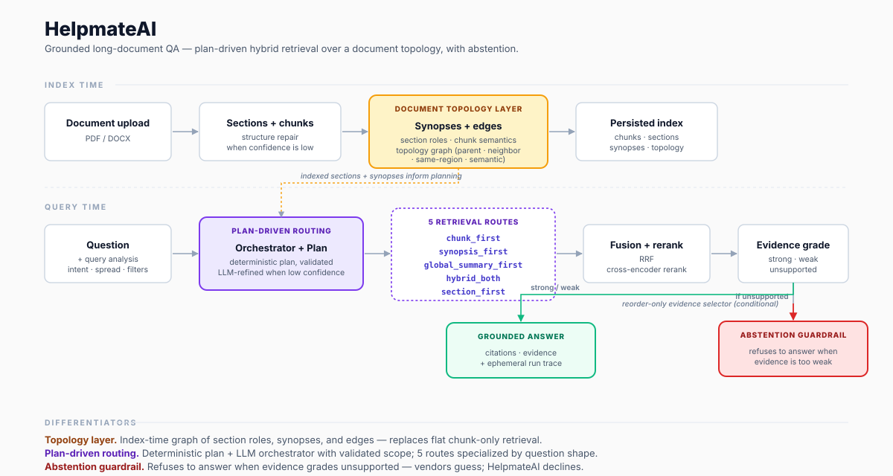
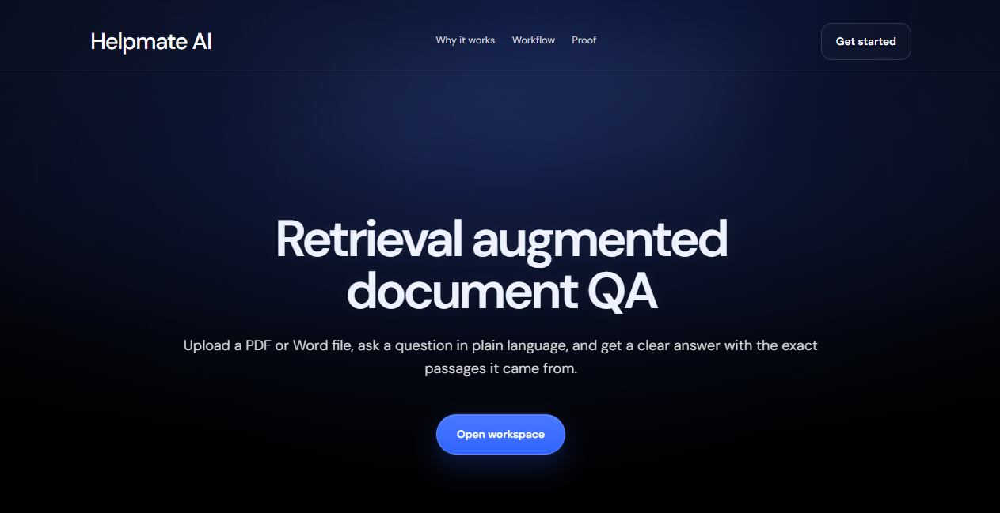
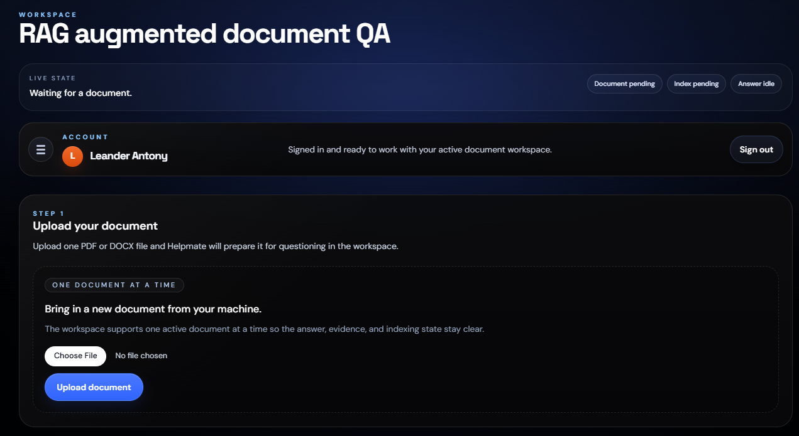
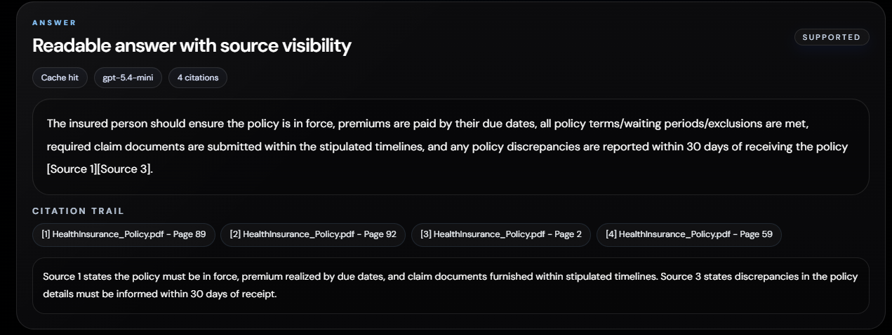
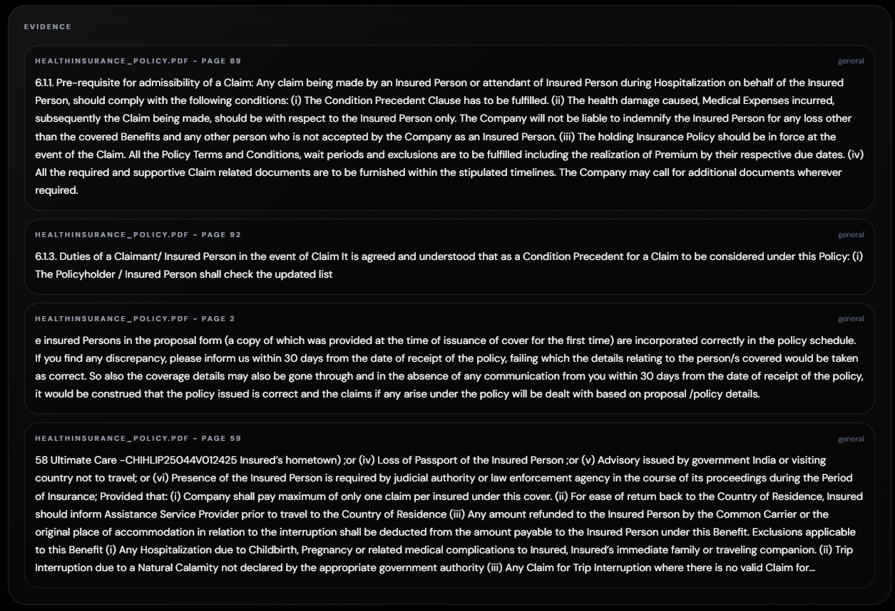

# HelpmateAI

HelpmateAI is a document-aware RAG system for long PDFs and DOCX files. It plans retrieval over document topology instead of treating every question as a flat dense top-k search.
It is built for the questions where ordinary "chat with PDF" systems break: broad thesis conclusions, research-paper contributions, policy clauses, scattered evidence, weak retrieval, and citation-sensitive answers.

**Try it live:** [helpmateai.xyz](https://helpmateai.xyz) (landing) · [app.helpmateai.xyz](https://app.helpmateai.xyz) (workspace)

## What Makes It Different

Most RAG demos retrieve the top chunks and hope the answer model can stitch them together. HelpmateAI treats retrieval as a planned workflow over a structured document map.

| Typical RAG failure | HelpmateAI behavior |
| --- | --- |
| "What are the conclusions?" returns a few random result paragraphs. | A dedicated `global_summary_first` route anchors overview, findings, discussion, and conclusion regions before assembling raw chunk evidence. |
| The model answers even when retrieval is weak. | Evidence is graded as `strong`, `weak`, or `unsupported`; unsupported questions stop before answer generation, and a verifier can mark a response as `partial` only when grounded facts and missing facts are both visible. |
| Section-scoped questions drift into the wrong chapter or policy region. | A bounded orchestrator can resolve explicit local scope to validated section IDs, with deterministic safety checks. |
| The right chunk appears in top-k but not at rank 1. | A spread-triggered, reorder-only evidence selector can promote stronger evidence without pruning away support. |
| Most RAG demos can't tell you *why* they picked their reranker, chunk size, or thresholds. | Every architectural choice is documented in ADRs and validated by ablation studies under `docs/evals/reports/`. |

## Product Preview

### Landing experience

### Workspace flow

| Workspace | Answer panel |
| --- | --- |
|  |  |

### Evidence visibility

## Latest Validation Snapshot

The latest held-out product-fit evaluation uses 150 fixed questions across five public documents: NIST AI RMF, an arXiv climate-ML paper, a public UPenn thesis, FOMC minutes, and the IRENA World Energy Transitions Outlook. The main HelpmateAI run is saved as [final_eval_suite_helpmate_150_aggregate_20260506.json](docs/evals/reports/final_eval_suite_helpmate_150_aggregate_20260506.json). A later targeted verifier-policy check on the 17 answerable abstentions recovered 6 clean supported answers and 1 partial answer; one suspicious arXiv metadata recovery was excluded from the corrected estimate because it matched a bibliography entry instead of the paper footer.

**Headline differentiator: in this 150-question suite, HelpmateAI produced zero false-support claims and correctly abstained on every unanswerable question. Vectara hallucinated support 20% of the time. OpenAI File Search did so 6.7%.**

The full product read:

| Metric | HelpmateAI | OpenAI File Search | Vectara |
| --- | ---: | ---: | ---: |
| Fixed questions | `150` | `150` | `150` |
| Answerable questions | `135` | `135` | `135` |
| Answerable coverage | `92.6%` | `94.1%` | `96.3%` |
| Strict fully supported rate | `89.6%` | `94.1%` | `96.3%` |
| False abstention rate | `7.4%` | `5.9%` | `3.7%` |
| False support rate | `0.0%` | `6.7%` | `20.0%` |
| Unsupported-question abstention | `100.0%` | `93.3%` | `80.0%` |
| RAGAS faithfulness, attempted only | `91.5%` | `96.1%` | `72.0%` |
| RAGAS answer relevancy, attempted only | `80.4%` | `83.4%` | `78.0%` |
| RAGAS context precision, attempted only | `83.9%` | `91.7%` | `78.9%` |

OpenAI and Vectara are run in their native answer modes under the protocol documented below: OpenAI File Search using file-search retrieval, Vectara using hybrid search with reranking and Mockingbird generation. (Earlier exploratory vendor runs used different settings and are not directly comparable to these numbers.) HelpmateAI does not claim blanket vendor superiority: the latest evidence is that it is competitive on answerable coverage, decisively stronger on conservative abstention and zero false support in this suite, and still has work left on tiny metadata/footer facts and table-heavy numeric evidence.

## Evaluation Methodology

Evaluation is treated as part of the architecture, not a one-off demo. The current final-eval harness uses fixed public documents, fixed question manifests, answerable and intentionally unsupported questions, per-intent reporting, and saved machine-readable reports under `docs/evals/reports/`.

The latest held-out suite uses:

- public source documents recorded in [final_eval_sources_20260428.md](docs/evals/final_eval_sources_20260428.md)
- fixed draft questions in [final_eval_manifest.draft.json](docs/evals/final_eval_manifest.draft.json)
- RAGAS scoring with a non-generator judge model where configured
- explicit abstention metrics alongside answer-quality metrics
- strict support metrics separated from partial-answer coverage metrics
- separate native-context and equalized-context modes for future product and controlled retrieval comparisons
- documented vendor comparison settings when OpenAI File Search or Vectara baselines are run

Full protocol details live in [final_eval_protocol.md](docs/evals/final_eval_protocol.md), with the broader evaluation plan in [next_steps_and_final_eval_plan.md](docs/internal/next_steps_and_final_eval_plan.md).

## How It Is Built

The retrieval core lives in `src/` and stays framework-agnostic. `backend/` exposes it through FastAPI upload, index, status, and ask endpoints. `frontend/` ships the Next.js workspace UI. `deploy/vps/` contains the Docker Compose and Caddy deployment path for the API, while the public app is split between landing, workspace, and backend surfaces.

Built with Next.js, FastAPI, `pypdf`, `pdfplumber`, `python-docx`, ChromaDB, OpenAI, sentence-transformers, scikit-learn, optional Supabase persistence, optional hosted Chroma-compatible storage, Docker, and `uv`.

Document ingestion uses `pypdf` for PDFs and `python-docx` for DOCX files, with a `pdfplumber`-backed table enrichment pass that selectively scans likely table-heavy pages and stores extracted tables as page-linked artifacts. Configuration knobs for extractors, table enrichment, and OCR live in `.env.example`.

Artifact interpretation is handled by the indexing-time chunk semantics layer when `HELPMATE_CHUNK_SEMANTICS_ENABLED=true`. Deterministic parsers propose raw candidates such as tables, footnotes, bibliography blocks, front matter, and acronym/definition snippets; the semantic layer classifies whether those candidates are useful evidence, metadata evidence, table evidence, definition evidence, or noise before retrieval uses them.

Document landmarks are built at indexing time when `HELPMATE_DOCUMENT_LANDMARKS_ENABLED=true`. A bounded model call reviews likely front/back matter and structural pages, then emits page-linked landmarks such as title page, foreword, abstract, executive summary, author/correspondence block, definition region, glossary, or volume boundary. These landmarks are indexed as normal evidence candidates with semantic labels rather than query-specific boosts.

Answer support is also checked in two layers. The answer model returns `supported`, `partial`, or `unsupported`; when the first pass is not fully supported, `HELPMATE_SUPPORT_STATUS_VERIFIER_ENABLED=true` runs a strict support-status verifier that can distinguish a genuinely unsupported refusal from a visible partial answer. It can recover a refused answer to full support only when the verifier identifies grounded supported facts, no missing required facts, no visible gap language, and no inferential phrasing.

## Current Limits

HelpmateAI is strongest on grounded long-document QA, policy questions, thesis/report navigation, and citation-visible answers. The hardest remaining cases are now artifact-precision problems: title-page and footer metadata, forewords and acknowledgements, abbreviation definitions, bibliography-confusable identifiers, and table-heavy numeric questions where row, column, unit, and caption context must stay intact.

Partial support is intentionally conservative: it is not treated as full support, and it is only allowed when the retrieved evidence supports a substantive part of the question while the visible answer explicitly states what the evidence does not provide.
