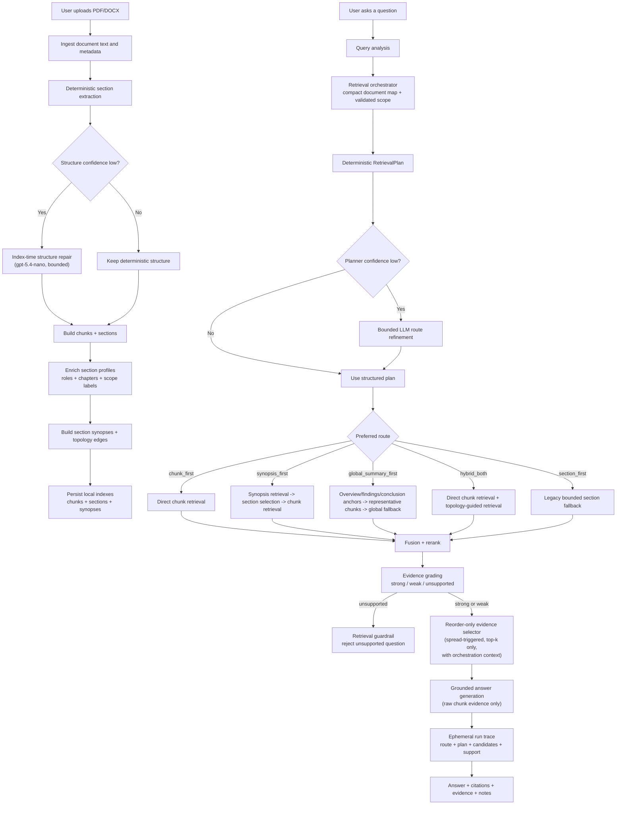

# Architecture Flow

This file is the quickest way to understand how HelpmateAI works today.

It is written for:

- repo visitors on GitHub
- collaborators joining the project
- future us when we want the current architecture in one place

## End-To-End Flow

## What Each Stage Does

### 1. Ingestion and indexing

- extracts text from PDF or DOCX
- builds sections and chunk records
- repairs only low-confidence section maps during indexing
- enriches sections with roles, chapter/page ranges, and reusable scope labels
- generates section synopses and lightweight topology edges
- persists everything locally for reuse

This is where the system gets smarter about document structure without paying query-time latency on every question.

Policy documents stay eligible for semantic indexing. The system recognizes policy-native headings and aliases such as coverage, benefits, exclusions, claims, waiting periods, eligibility, renewal, and definitions, but still gates extra model work on structure/synopsis quality.

### 2. Query analysis and planning

- classifies the question by intent and evidence spread
- lets a bounded orchestrator interpret explicit local scope against the indexed document map
- builds a structured `RetrievalPlan`
- uses a tiny LLM only when plan confidence is low

Important plan dimensions:

- `intent_type`
  - `lookup`
  - `summary`
  - `comparison`
  - `procedure`
  - `numeric`
  - `cross_cutting`
- `evidence_spread`
  - `atomic`
  - `sectional`
  - `distributed`
  - `global`
- `constraint_mode`
  - `none`
  - `soft_local`
  - `soft_multi_region`
  - `hard_region`

Important orchestration dimensions:

- `allowed_section_ids`
- `scope_strictness`
- `scope_query`
- `answer_focus`

The orchestrator can suggest scope, but deterministic validation decides whether that scope is enforceable.

### 3. Retrieval routes

#### `chunk_first`

Used for:

- exact factual questions
- clause/page-specific questions
- local evidence questions

Why it exists:

- this is still the strongest path for precise grounded retrieval

#### `synopsis_first`

Used for:

- section-level questions
- broader narrative questions
- questions that benefit from structural narrowing first

Why it exists:

- section synopses help the system choose the right document region before chunk retrieval

#### `global_summary_first`

Used for:

- broad paper/thesis/report questions like:
  - `What is this paper about?`
  - `What is the main contribution?`
  - `What are the key findings?`

How it works:

- retrieves top section synopses
- chooses a small anchor set:
  - overview-like section
  - findings/results-like section
  - discussion/conclusion-like section if helpful
- seeds representative chunks from those anchors
- adds a bounded global fallback pool

Why it exists:

- broad-summary failures often were not true retrieval failures
- the system needed a better evidence bundle, not a different answer model

#### `hybrid_both`

Used for:

- mixed questions
- distributed evidence questions
- detail-sensitive questions where both direct chunks and topology guidance help

### 4. Evidence grading and guardrails

After reranking, evidence is graded as:

- `strong`
- `weak`
- `unsupported`

If evidence is `unsupported`, the question stops there.

That means:

- irrelevant questions do not flow into answer generation
- unsupported answers fail honestly

### 5. Reorder-only evidence selection

If evidence is plausible, the system can run a small selector over top retrieved chunks.

It:

- only sees the top candidates
- receives the validated retrieval/orchestration context
- uses rank as a prior
- can promote a lower-ranked chunk if it is clearly more direct
- keeps the remaining retrieved chunks instead of pruning them away
- never invents evidence

This exists to fix cases where the right chunk was already in top `k` but not at rank 1.

### 6. Answer generation

The final answer stage:

- sees only retrieved chunk evidence
- returns `supported` or unsupported
- includes citations and evidence details
- stays conservative when evidence is weak

The answer stage does not treat synopses as final evidence. Synopses help retrieval, not grounding.

### 7. Run tracing

For uncached QA runs, the backend writes a compact trace containing:

- route and plan context
- candidate IDs, scores, pages, sections, and short previews
- support status and citations

Traces expire with the workspace and do not store full document text or full answer bodies.

## Mental Model

HelpmateAI is no longer:

- plain similarity search over chunks

It is now:

- document-aware retrieval planning
- topology-guided evidence assembly
- validated orchestration for explicit local scope
- bounded evidence correction
- chunk-grounded answer generation

## Current Strengths

- strong exact factual retrieval
- strong policy-document behavior
- recovered thesis performance
- improved paper/report handling through topology and structure repair
- better local chapter/section handling through smart section profiles and orchestration
- reorder-only evidence selection is now benchmark-validated in the default stack
- workflow decisions are traceable under the same retention policy as documents
- explicit unsupported-question guardrails
- benchmarked against internal and external baselines

## Current Weakest Area

The hardest remaining cases are still:

- the broadest paper-summary prompts on some journal-style PDFs
- the remaining unrepaired `reportgeneration2` structure-noise case
- proving orchestrator behavior on a broader held-out scoped-query set

That is much narrower than before, which is a good sign. The architecture is now stable enough that further work can be more targeted rather than another big rewrite.
